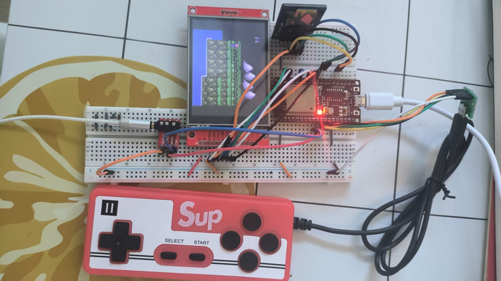

# ESP32 移植nes模拟器

使用esp32 WROOM模组
资料：参照esp关于nes模拟器移植的官方文档：https://github.com/espressif/esp32-nesemu

控制器实现参考了韦东山老师的项目：https://gitee.com/weidongshan/esp32_100ask_project.git

- master分支：
完成了nes文件的加载，游戏的显示，但是还未接入控制器和声音播放器
该分支只能显示nes游戏画面

--- 
1. 使用到的硬件：
- ESP32 WROOM模组
- ILI9341 3.2寸显示屏（320 * 240）
- FC手柄（掌上游戏机手柄）
- CJMCUTRRS 3.5mm 音频座模块

---
2. 连接：
- 显示屏连接

    |Pin | GPIO|
    |---|---|
    MISO  | -
    MOSI  | 23
    CLK   | 19
    CS    | 22
    DC    | 21
    RST   | 18
    BCKL  | 5

- 控制器连接
    
    |Pin | GPIO|
    |---|---|
    DATA(D-)  | 27
    CLOCK(DI) | 15
    LATCH(D+) | 26

- 音频座连接

    |Pin | GPIO|
    |---|---|
    TIP   | 25
    RING1 | 26
    RING2 | 悬空
    SLEEVE| GND

3. 游戏画面：

    

